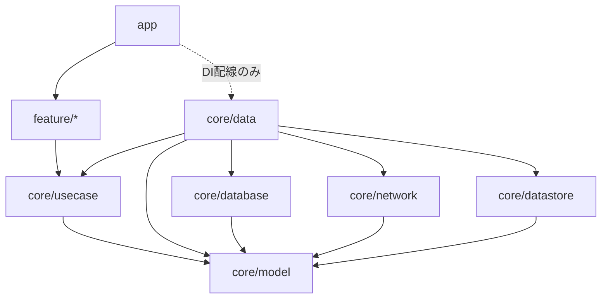

# Clean Architecture 規約

本プロジェクトにおける Clean Architecture の定義と規約。本書は「今後の Android アプリ開発の参照用サンプル」としての規範であり、リアーキおよび以後の全実装はこの規約に従う。ドメインモデリングの詳細は [ddd.md](./ddd.md) を参照。

## 1. 層の定義

本プロジェクトは、Clean Architecture 原典の同心円に対応する 3 層で構成する。domain 層は責務に応じて 2 モジュールに分ける（Entity 層と UseCase 層）。

| 層 | 責務 | 配置 |
|---|---|---|
| **domain / Entity** | Entity・Value Object・読み取り用ビュー。振る舞いを持つドメインモデル（Enterprise Business Rules） | `core/model` |
| **domain / UseCase** | UseCase・Repository インターフェース（Application Business Rules） | `core/usecase` |
| **data** | Repository 実装、データソース（Room / Retrofit / DataStore）、データモデル ↔ ドメインモデルの変換 | `core/data`, `core/database`, `core/network`, `core/datastore` |
| **presentation** | Compose UI と ViewModel。UDF（単一データフロー）で画面状態を管理 | `feature/*`, `app` |

Clean Architecture 原典の同心円との対応:

- **Entities（最内・Enterprise Business Rules）= `core/model`**。Entity・Value Object・集約・読み取りビューを置く。振る舞いを持つドメインモデル（詳細は ddd.md）
- **Use Cases（Application Business Rules）= `core/usecase`**。UseCase と Repository インターフェースを置き、`core/model` のみに依存する

> `core/model` は独立モジュールとして維持する（`core/usecase` への吸収はしない）。理由: `core/database` / `core/network` / `core/datastore` などデータソースモジュールはマッパーのためにドメインモデルの型だけを必要とする。これらを UseCase を含む `core/usecase` に依存させると最下層が Application Business Rules を知る層違反になるため、Entity 層を `core/model` として切り出す。

## 2. 依存ルール

**依存は常に内側（Entity）へ向ける。最内の `core/model` は誰にも依存しない。**

```
presentation ──→ core/usecase ──→ core/model ←── data
```

- `core/model` は他のモジュールに依存しない純 Kotlin（kotlinx-datetime のみ許可）
- `core/usecase` は `core/model` にのみ依存する。Android フレームワークに依存しない（純 Kotlin。kotlinx-coroutines / javax.inject を許可）
- Repository は **インターフェースを `core/usecase` に置き、実装を `core/data` に置く**（依存逆転）
- `core/model` は独立モジュールとして維持する（`core/usecase` への吸収はしない。理由は §1）
- presentation（feature）は `core/usecase`（と `core/model`）のみに依存し、`core/data` 以下のデータ層モジュールを参照してはならない（DI 配線を行う `app` を除く）

### モジュール依存図



## 3. UseCase 規約

- **ViewModel は Repository を直接参照しない。domain へのアクセスは必ず UseCase を経由する**。Repository を呼ぶだけの薄い UseCase も許容する（規律の一貫性を優先）
- 1 UseCase = 1 責務。公開メソッドは `operator fun invoke` のみ
- シグネチャは 2 種類に限定する:

| 種別 | 命名 | シグネチャ | エラー |
|---|---|---|---|
| 観察系 | `Observe〜UseCase` | `operator fun invoke(...): Flow<T>` | Flow の `catch` で処理し UiState.Error に変換 |
| 操作系 | 動詞始まり（`FollowTopicUseCase` 等） | `suspend operator fun invoke(...): Result<Unit>` | `kotlin.Result` で返す |

- 観察系が Flow を返すのは、Room / DataStore の変更に UI がリアクティブに追従する（書き込み後の手動再取得を不要にする）ため
- エラー型は標準の `kotlin.Result` を使う。失敗種別による UI 分岐が必要になった時点で、その UseCase に限り sealed なエラー型を導入する（先回りで作らない）

```kotlin
// 観察系の例
class ObserveFollowableTopicsUseCase @Inject constructor(
    private val topicsRepository: TopicsRepository,
    private val userDataRepository: UserDataRepository,
) {
    operator fun invoke(): Flow<List<FollowableTopic>> = ...
}

// 操作系の例
class FollowTopicUseCase @Inject constructor(
    private val userDataRepository: UserDataRepository,
) {
    suspend operator fun invoke(topicId: TopicId, followed: Boolean): Result<Unit> = ...
}
```

## 4. Repository 規約

- インターフェースは `core/usecase` の repository パッケージに置き、ドメインモデルのみを引数・戻り値に使う
- 実装は `core/data` に置く。実装クラス名は実装特性を表す（`OfflineFirstNewsRepository`）か `Default〜` とする
- 観察系メソッドは `Flow<T>`、操作系メソッドは `suspend fun` とする（UseCase のシグネチャ区分と対応）

## 5. presentation 層（MVVM + 単一データフロー）規約

- 画面ごとに **単一の UiState** と **単一のイベント入口 `onEvent`** を持つ（MVI ライト）
- ViewModel が公開するのは `uiState: StateFlow<XxxUiState>` と `fun onEvent(event: XxxEvent)` の 2 つのみ。個別のコールバック関数を生やさない
- 命名: `画面名 + UiState`（sealed interface。`Loading` / `Success` / `Error` を基本とする）、`画面名 + Event`（sealed interface）
- データの流れは一方向に固定する: `UseCase → UiState → Compose UI → Event → ViewModel → UseCase`

```kotlin
sealed interface BookmarksUiState {
    data object Loading : BookmarksUiState
    data class Success(val feed: List<UserNewsResource>) : BookmarksUiState
    data object Error : BookmarksUiState
}

sealed interface BookmarksEvent {
    data class RemoveBookmark(val id: NewsResourceId) : BookmarksEvent
    data class MarkViewed(val id: NewsResourceId) : BookmarksEvent
}
```

- Compose UI は UiState を描画し Event を発行するだけの存在とする。ビジネス判断を UI に書かない

## 6. Mapper 規約

- モデル変換は必ず **data 側のモジュール**（`core/database` / `core/network` / `core/datastore` / `core/data`）に置く。これらは `core/model` に依存してドメインモデルへ変換する。`core/model` / `core/usecase` は data のモデル（Room エンティティ・DTO・Proto）を一切知らない
- 形式は拡張関数とし、命名を統一する:
  - data モデル → ドメインモデル: `toDomain()`
  - ドメインモデル → Room エンティティ: `toEntity()`
  - ドメインモデル → DTO: `toNetwork()`
- DI で注入する Mapper クラスは作らない（状態を持たない純粋関数の変換に DI は過剰）

## 7. テスト規約

- UseCase はロジック（合成・分岐・ソート・`Result` の成否など）を持つものに単体テストを書く（Repository をテストダブルに差し替え）。Repository を 1 行呼ぶだけの純粋な委譲 UseCase はテストダブルの確認に過ぎないため省略し、ViewModel テストで間接的に検証する
- ViewModel テストは `onEvent` 経由で操作し、`uiState` の遷移を検証する
- リアーキの各ステップは `./gradlew assembleDemoDebug` とユニットテストが green であることを完了条件とする

## 8. 適用範囲

- 対象: 全 feature（foryou / bookmarks / interests / search / settings / topic）と core 層
- `sync` は data 層の実装詳細と位置づけ、依存逆転への追従修正のみ行う（UI を持たないため UseCase 経由の規律は適用しない）
- `app-nia-catalog` / `benchmarks` はアーキテクチャの対象外。ビルドが通る状態のみ維持する