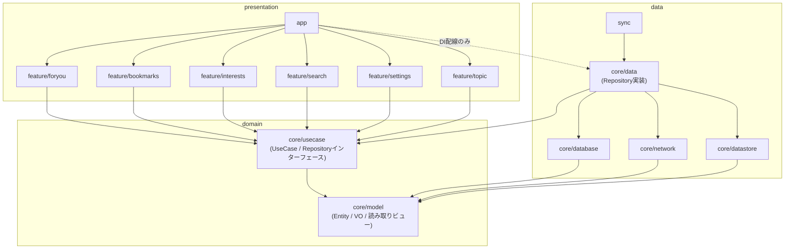
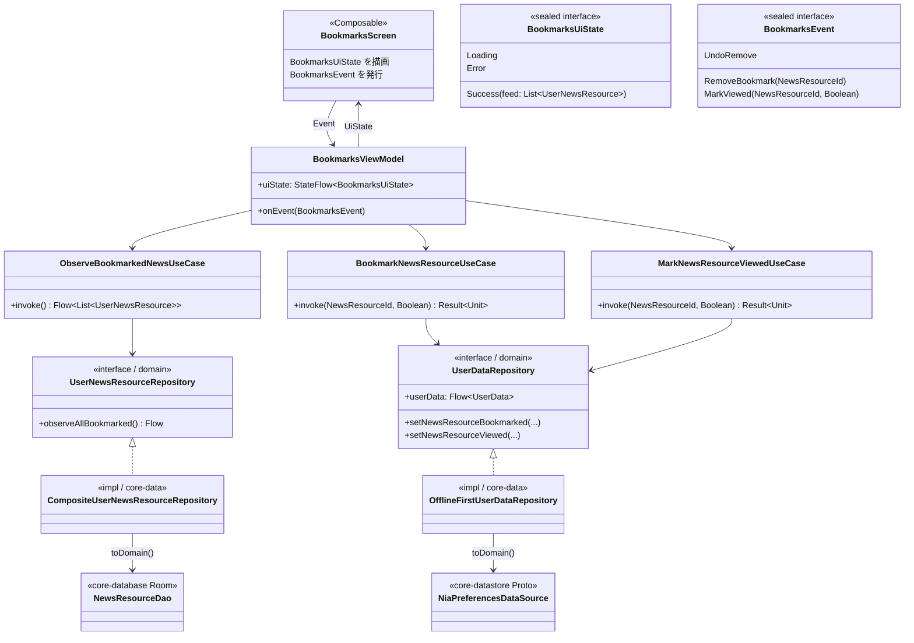

# コンポーネント設計・全体像

[clean-architecture.md](./clean-architecture.md) / [ddd.md](./ddd.md) の規約を NowInAndroid に適用したターゲット設計。リアーキはこの図に向かって進める。

## 1. 全体像（モジュール依存図）

依存は常に最内の `core/model`（Entity 層）へ向かう。`core/model` は独立モジュールとして維持する（`core/usecase` への吸収はしない。理由は clean-architecture.md §1）。



- `core/designsystem` `core/ui` `core/navigation` `core/common` `core/analytics` `core/notifications` は横断的な支援モジュールであり層の図からは省略（presentation・data から利用可。`core/ui` は `core/model` に依存。`core/usecase` からは利用不可）
- `app-nia-catalog` / `benchmarks` は対象外（ビルド維持のみ）

## 2. core/model と core/usecase の内部構成

```
core/model/          # Entity 層（既存モジュールを維持。Android 非依存の純 Kotlin）
├── Topic.kt              # Entity（TopicId で同一）
├── NewsResource.kt       # Entity（NewsResourceId で同一）
├── UserData.kt           # 集約ルート（isFollowing 等の振る舞いを持つ）
├── TopicId.kt            # VO（value class・新規）
├── NewsResourceId.kt     # VO（value class・新規）
├── DarkThemeConfig.kt / ThemeBrand.kt   # VO（enum）
├── FollowableTopic.kt / UserNewsResource.kt / UserSearchResult.kt  # 読み取り用ビュー
└── RecentSearchQuery.kt

core/usecase/         # UseCase 層（core/model にのみ依存）
├── repository/      # インターフェースのみ（実装は core/data。core/data から移動）
│   ├── TopicsRepository.kt
│   ├── NewsRepository.kt
│   ├── UserDataRepository.kt
│   ├── RecentSearchRepository.kt
│   ├── SearchContentsRepository.kt
│   └── UserNewsResourceRepository.kt
└── usecase/         # 下記一覧の 19 個
```

## 3. UseCase 一覧

現行 6 ViewModel + MainActivityViewModel の Repository 直接呼び出しを棚卸しし、共有可能なものを統合した結果。

### 観察系（`operator fun invoke(...): Flow<T>`）

| UseCase | 戻り値 | 利用画面 | 置き換え対象（現行） |
|---|---|---|---|
| `ObserveUserDataUseCase` | `Flow<UserData>` | settings, foryou, app | `userDataRepository.userData` |
| `ObserveFollowableTopicsUseCase` | `Flow<List<FollowableTopic>>` | interests, foryou | `GetFollowableTopicsUseCase`（リネーム） |
| `ObserveFollowableTopicUseCase(TopicId)` | `Flow<FollowableTopic>` | topic | `topicsRepository.getTopic` + `userData` の合成 |
| `ObserveTopicNewsUseCase(TopicId)` | `Flow<List<UserNewsResource>>` | topic | `userNewsResourceRepository.observeAll(filterTopicIds)` |
| `ObserveFollowedNewsUseCase` | `Flow<List<UserNewsResource>>` | foryou | `observeAllForFollowedTopics()` |
| `ObserveUserNewsUseCase(query)` | `Flow<List<UserNewsResource>>` | foryou（オンボーディング中・ディープリンク） | `observeAll(filterTopicIds/filterNewsIds)` |
| `ObserveBookmarkedNewsUseCase` | `Flow<List<UserNewsResource>>` | bookmarks | `observeAllBookmarked()` |
| `ObserveSearchResultsUseCase(query)` | `Flow<UserSearchResult>` | search | `GetSearchContentsUseCase`（リネーム） |
| `ObserveRecentSearchQueriesUseCase` | `Flow<List<RecentSearchQuery>>` | search | `GetRecentSearchQueriesUseCase`（リネーム） |
| `ObserveSearchContentsCountUseCase` | `Flow<Int>` | search | `searchContentsRepository.getSearchContentsCount()` |

### 操作系（`suspend operator fun invoke(...): Result<Unit>`）

| UseCase | 引数 | 利用画面 | 置き換え対象（現行） |
|---|---|---|---|
| `FollowTopicUseCase` | `TopicId, Boolean` | foryou, interests, search, topic | `setTopicIdFollowed` |
| `BookmarkNewsResourceUseCase` | `NewsResourceId, Boolean` | bookmarks, foryou, search, topic | `setNewsResourceBookmarked` |
| `MarkNewsResourceViewedUseCase` | `NewsResourceId, Boolean` | bookmarks, foryou, search, topic | `setNewsResourceViewed` |
| `SetThemeBrandUseCase` | `ThemeBrand` | settings | `setThemeBrand` |
| `SetDarkThemeConfigUseCase` | `DarkThemeConfig` | settings | `setDarkThemeConfig` |
| `SetDynamicColorPreferenceUseCase` | `Boolean` | settings | `setDynamicColorPreference` |
| `DismissOnboardingUseCase` | なし | foryou | `setShouldHideOnboarding(true)` |
| `SaveRecentSearchUseCase` | `String` | search | `insertOrReplaceRecentSearch` |
| `ClearRecentSearchesUseCase` | なし | search | `clearRecentSearches` |

備考:

- `DismissOnboardingUseCase` は `setShouldHideOnboarding(true)` をドメインの意図（オンボーディングを閉じる）で命名し直したもの
- `setFollowedTopicIds`（一括設定）は現行 ViewModel で未使用のため UseCase 化しない。`populateFtsData` は sync 系の処理であり UseCase 化しない
- 4 画面で共有される `FollowTopicUseCase` / `BookmarkNewsResourceUseCase` / `MarkNewsResourceViewedUseCase` が「UseCase に置くことで重複を排除できる」代表例

## 4. 代表詳細図: bookmarks

全 feature はこのパターンの適用で、bookmarks を手本とする。



データフロー（単一方向）:

```
Room/DataStore → Repository実装(toDomain) → Repositoryインターフェース → Observe系UseCase
  → ViewModel(UiState) → Compose UI → Event → ViewModel.onEvent → 操作系UseCase → Repository → Room/DataStore
  （書き込み結果は Flow 経由で自動的に UiState へ還流する）
```

## 5. リアーキ実行ステップ（再掲）

1. **基盤（依存逆転）**: Repository インターフェースを `core/data` → `core/usecase` へ移動、`core/usecase` の `api(core/data)` 依存を除去して `core/model` のみ依存に変更、`core/data` を `core/usecase` 依存に変更、ID の value class 化、`UserData` への振る舞い追加（各コミットで green）。`core/model` モジュールは維持
2. **UseCase 層**: 上記 19 UseCase を作成・単体テスト追加。既存 3 UseCase はリネーム
3. **feature 順次変換**: bookmarks → settings → topic → interests → search → foryou の順に、`core/data` 直接依存を `core/usecase` 依存へ張り替え、UiState + onEvent 化、テスト移植
4. **同期**: AGENT.md / AGENTS.md / README を新アーキの説明に更新
